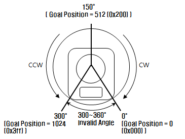
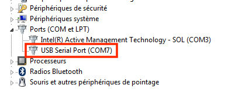

# Séance 2  
## Réalisation expérimentale d'un robot sériel : montage, caractérisation et commande des actionneurs.

### UE : L3 Elec/Méca – LU3MEE01  
**Introduction à la Robotique**

---

> *Pour rappel, et comme indiqué dans l'introduction, les questions repérées par un encadré gris sont celles pour lesquelles il est demandé une réponse détaillée et argumentée dans votre compte-rendu final.*

---

## 1. Présentation du système robotique

L'objectif de ce projet est la **réalisation et le contrôle d’un bras robotisé** fonctionnant dans le plan, à l’aide de moteurs identiques. Il s’agira de :

- Connecter le robot à une alimentation et à son contrôleur ;
- Caractériser chacun des actionneurs ;
- Contrôler la position de l’organe terminal du bras.

Le contrôle des moteurs se fera via **Python** et une **librairie dédiée**. Les fonctions utilisées au TP1 pourront être réutilisées après adaptation au robot réel (cf. annexe).

---

### 1.1. Moteurs DYNAMIXEL

Les moteurs DYNAMIXEL de la gamme AX sont :

- Petits, légers, puissants ;
- Dotés de : réducteur, contrôleur, fonction réseau, pilote ;
- Contrôlés via un **protocole TTL série asynchrone half-duplex** ;
- Programmables via **Bibliothèque Python**.

Voici les caractéristiques du **Dynamixel AX12** utilisé :

| Caractéristique                  | Valeur                                                            |
|----------------------------------|--------------------------------------------------------------------|
| Tension de fonctionnement        | 9 à 12V                                                            |
| Couple de décrochage             | 1,52 Nm à 12V et 1,5A                                              |
| Vitesse hors-charge              | 59 tours/min (à 12V)                                               |
| Rapport de réduction             | 254:1                                                              |
| Vitesse de communication         | 7343 bps ~ 1 Mbps                                                  |
| Lien physique                    | TTL, multi-drop (type daisy-chain)                                |
| Protocole                        | Half-duplex, série async (8bit, 1 stop, no parity)                |
| Retour d’information             | Position, température, tension, charge...                         |
| Poids                            | 54,6 g                                                             |

---

Les moteurs sont identifiés par un **ID unique** normalement 1,2 et 3 suivant l'emplacement des moteurs. Si un des moteurs n'est pas reconnu, il faudra le flasher (voir annexe).
Pour les moteurs Dynamixel AX-12, la plage de position qui va de 0 à 1023 (10 bits), ce qui correspond à une plage de rotation d'environ 300° (±150° autour de la position centrale).

#### Exemple de repérage de position angulaire :



---

### 1.2. Interface USB2DYNAMIXEL ou U2D2
> Ces interfaces permettent de relier les moteurs AX12 à un ordinateur via USB.

Connexion série entre moteur(s) et PC via cette interface :

- Connecter les moteurs en série (daisy-chain).
- Identifier le port série **selon votre système d’exploitation** :

| OS       | Commande / Méthode                                                                 |
|----------|-------------------------------------------------------------------------------------|
| Linux    | `ls /dev/ttyUSB*` → ex: `/dev/ttyUSB0`                                              |
| Mac      | `ls /dev/tty.usbserial*` → ex: `/dev/tty.usbserial-XXXXXX`                         |
| Windows  | Panneau de config → Gestionnaire de périphériques → Port (COM et LPT) → COMX       |



> ⚠️ Le commutateur de l’interface USB2DYNAMIXEL doit être en position **1 (TTL)**.  
> Sur U2D2, brancher le câble 3 fils sur la prise **TTL**.

---

### 1.3. Librairie Python

Utiliser la bibliothèque Python :

```bash
pip install dynamixel-controller
```
```python
from dynio import *
```

## Maquette

Vous disposez d'une maquette équipée de :

- une interface USB2DYNAMIXEL ou U2D2 et sa rallonge USB,  
- une entrée d'alimentation possiblement équipée d'un interrupteur,  
- un support sur lequel est monté le bras robotique,  
- une alimentation,  
- différents câbles de raccordement (alimentation et communication).

---

## Travail demandé

### Prise en main du contrôle des moteurs

1. Les moteurs sont dotés d'un indicateur représentant le zéro moteur (la position 150° sur la figure 1). Vérifier avec l'enseignant la bonne position de ce marqueur sur la chaîne cinématique.
2. Connecter la rallonge USB à l'ordinateur et à l'USB2DYNAMIXEL. Identifier le numéro du port série selon la démarche indiquée à la section « USB2DYNAMIXEL ». Vérifier que l'interrupteur présent sur l'USB2DYNAMIXEL est bien en position 1 (TTL).
3. À l'aide des connecteurs fournis, brancher le moteur à l'USB2DYNAMIXEL. Les deux connecteurs présents sur le moteur peuvent être utilisés indifféremment.
4. Connecter l'alimentation sur la maquette et au secteur. Allumer la puissance grâce à l'interrupteur présent sur la maquette. La diode présente sur le moteur doit normalement s'allumer un instant, puis s'éteindre.
5. Éditer le contenu du fichier `main.py` :
   - Modifier la valeur de la variable `portName` de façon à ce qu'elle soit identique au numéro du port série identifié.
   - Modifier la valeur de la variable `connected` à `True`.
6. Dans la classe `Motor`, utiliser la fonction `set_position` dans `__init__` de la bibliothèque `dynamixel-controller` pour bouger le moteur commandant le bout du bras en une position `pos` quelconque (voir figure correspondante). Commenter.
7. Vous pouvez aussi modifier la valeur de la vitesse de rotation du moteur à l'aide de la fonction `set_velocity`, et réexécuter différents mouvements (consulter la section dédiée à la vitesse pour déterminer les paramètres/valeurs à fournir à la fonction).

---

### Caractérisation des actionneurs

Comme vous avez pu le remarquer, les appels aux fonctions ne sont pas bloquants. Ainsi, il est possible, par exemple, de lire la position et/ou vitesse du moteur tandis que celui-ci est en mouvement. Nous allons utiliser cette possibilité pour caractériser le fonctionnement de ces actionneurs.

#### Utilisation du moteur en bout de chaîne cinématique

> 1. Exprimer la relation mathématique reliant les valeurs des pas moteurs lues depuis l'actionneur en valeur angulaire exprimée en degrès. 

2. En déduire une fonction `pos_to_deg` qui permet de convertir une valeur de pas moteur (`step`) en un angle `q` exprimé en degrès. 

> 3. Inverser la relation obtenue précédemment pour obtenir l'expression reliant cette fois un angle exprimé en degrès à la valeur de pas moteur correspondante.

4. En déduire une fonction `deg_to_pos` qui convertit un angle `q` exprimé en degrès en une valeur de pas moteur `p`.

> 5. Pour un mouvement allant de la position moteur 0 à 1023 à une vitesse moyenne, tracer en fonction du temps :
>     - Cette position sera exprimée d'abord en "pas moteur", puis en degrés ou radians.
>     - Effectuer ce tracé pour différentes valeurs de consignes de vitesse.
>     - Sur la base des tracés en position obtenus, vérifier que la consigne de vitesse est effectivement respectée. Expliquer la méthode et commenter.

6. La bibbliothèque permet également de mesurer directement la vitesse de rotation et position du moteur à l'aide de la fonction. En tenant compte des spécifications rappelées dans la section dédiée, écrire une fonction `getSpeed` qui convertit la valeur brute  renvoyée par `get_velocity` en une vitesse `v` exprimée en tours/minute.

> 7. Pour un mouvement allant de la position moteur 250 à 950 :
>     - Tracer l'évolution de la vitesse (en tour/min) de l'actionneur en fonction du temps. Comparer cette valeur mesurée avec la valeur de consigne réglée par `setSpeed`. Commenter.
>     - Estimer la vitesse par différence finie sur la courbe de position. Comparer cette estimation à la valeur mesurée. Conclure.
>     - Répéter plusieurs essais identiques, et évaluer la répétabilité des caractéristiques du mouvement :
>         - Choisir une position initiale et finale, et faire plusieurs allers-retours pour différentes vitesses.
>         - Estimer la moyenne des erreurs de position en fonction de la vitesse. Conclure sur l'influence de la vitesse sur la précision angulaire.

---

### Maquette du robot 3R plan

Il s'agit maintenant de contrôler un robot 3R plan que nous allons commander à l’aide des fonctions utilisées lors du TP1 pour modéliser le robot réel.

1. Représenter le schéma cinématique du robot réalisé. Nommer les angles de rotation et identifier les paramètres géométriques nécessaires.
2. À l’aide de la fonction `MGD`, déterminer en simulation la position `(x, y)` de l’organe terminal pour deux commandes motrices `q1` et `q2` de votre choix. Appliquer ces deux commandes au robot réel et vérifier la correspondance entre la position atteinte et celle obtenue en théorie.
> 3. Faire faire une trajectoire articulaire de votre choix à la maquette. Pendant le mouvement du robot, lire en continu les  positions articulaires des moteurs et afficher le comportement du modèle sur l’écran. Comparer les mouvements de la maquette réelle et  de son modèle.


